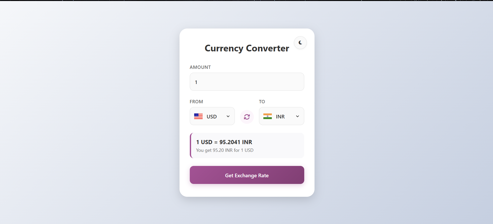
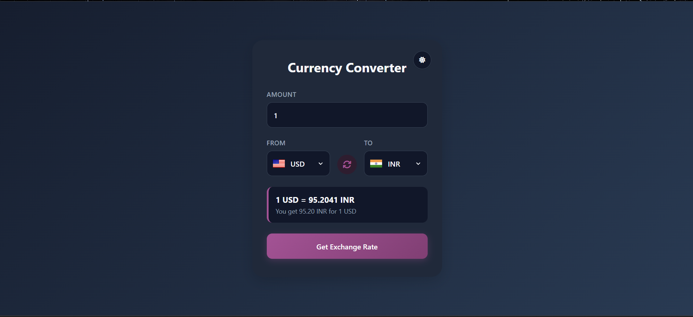

# 💱 Currency Converter

A modern, responsive **Currency Converter** built using **HTML, CSS, and JavaScript**. It provides real-time exchange rates, supports multiple international currencies, includes a dark/light theme, country flags, and a clean user interface.

---

## 🚀 Features

* 🌍 Convert between multiple international currencies
* 📈 Live exchange rates using a public Currency API
* 🔄 One-click currency swap
* 🌐 Country flags for selected currencies
* 🌙 Dark & Light theme with persistent preference
* ⚡ Automatic conversion while typing
* 🛡️ Input validation and error handling
* 📱 Fully responsive design
* ⌨️ Press **Enter** to convert instantly
* 💾 Theme preference saved using Local Storage
* 🔄 Loading state during API requests

---

## 🛠️ Tech Stack

* HTML5
* CSS3
* JavaScript (ES6+)
* Font Awesome
* Currency API by Fawaz Ahmed

---

## 📂 Project Structure

```text
Currency-Converter/
│
├── index.html
├── style.css
├── script.js
├── codes.js
├── README.md
└── assets/
```

---

## 📦 Installation

1. Clone the repository

```bash
git clone https://github.com/Nk7781/Currency-Converter.git
```

2. Navigate into the project folder

```bash
cd Currency-Converter
```

3. Open `index.html` in your browser.

No additional dependencies or installation steps are required.

---

## 🔗 API Used

This project uses the free Currency API provided through jsDelivr.

```
https://cdn.jsdelivr.net/npm/@fawazahmed0/currency-api@latest/v1/currencies/
```

The API provides real-time exchange rates for a wide range of international currencies.

---

## 🎯 How It Works

1. Select the source currency.
2. Select the destination currency.
3. Enter the amount.
4. The application automatically fetches the latest exchange rate.
5. The converted value is displayed instantly.
6. Use the swap button to exchange the selected currencies.

---

## ✨ Highlights

* Clean and intuitive interface
* Instant conversion
* Responsive layout for desktop and mobile
* Persistent dark/light theme
* Error handling for invalid inputs
* Network failure detection
* User-friendly loading indicators

---

## 📸 Screenshots

### 🌞 Light Mode

<p align="center">
  
</p>

### 🌙 Dark Mode

<p align="center">
  
</p>

---

## 🔮 Future Improvements

* 📊 Exchange rate history charts
* ⭐ Favorite currencies
* 📋 Conversion history
* 🔍 Searchable currency dropdowns
* 🔔 Toast notifications
* 📈 Trending currencies dashboard
* 🌐 Offline support using Service Workers
* 💱 Currency symbols and formatting enhancements

---

## 🤝 Contributing

Contributions are welcome.

1. Fork the repository.
2. Create a new feature branch.
3. Commit your changes.
4. Push the branch.
5. Open a Pull Request.

---

## 📄 License

This project is licensed under the MIT License.

---

## 👨‍💻 Author

**Neelakantha Sahu**

If you found this project useful, consider giving it a ⭐ on GitHub.
